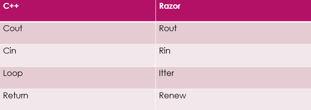

# Razor

* Razor is the compiler language of diversity and proving that it has many improvements and enhancements to work on.
* Razor means rapidly and sharply, thought to enquire the meaning as its quality and true meaning.

## Purpose of Razor!

* It includes integer, string variables, arrays, nested functions, and nested loops.
* It solves problems efficiently
* Is rather user friendly than being complex.

## Keywords

* Renew
* If
* Itter
* Rout
* Rin 

## Comparison 

